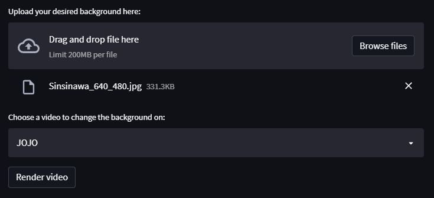
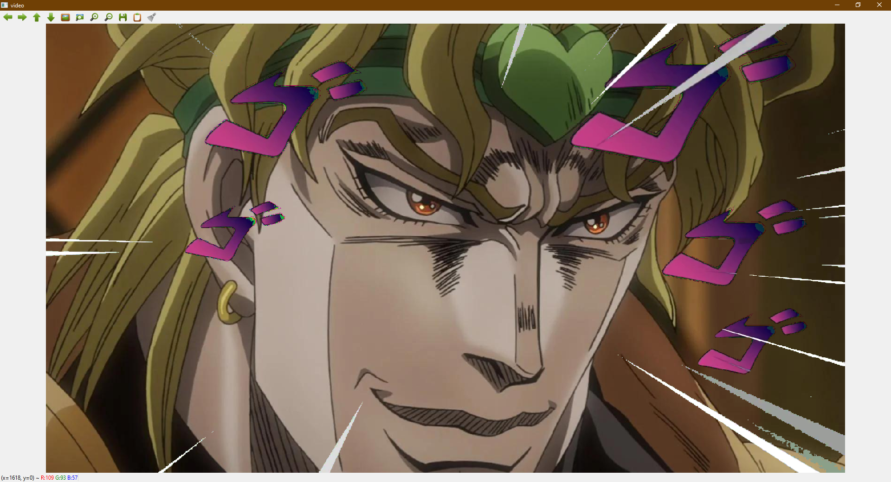

# Green Screen Video background changer
With this project, you can change the greenscreen background of videos.
There are 3 videos added to the streamlit interface that you can try out.

    AYAY.mp4 - 1920 x 1080
    bateman_greenscreen.mp4 - 1920 x 1080
    greenscreen_jameson.mp4 - 640 x 360

##Requirements
- openCV 4.5.5
- streamlit 1.8.1
- numpy 1.21

##Usage

You can run the application from the terminal, by running the main.py file in streamlit.

    streamlit run main.py

Then upload your desired image, choose a video to change its background, and click the render video button.

After that, enjoy the result!

If you want to add you own video, you can add it into the following lines:

    select = st.selectbox('Choose a video to change the background on:', options=['Jameson', 'Mimic guy', 'JOJO'])

    if select == 'Jameson':
        video = cv.VideoCapture('video/greenscreen_jameson.mp4')
    if select == 'Mimic guy':
        video = cv.VideoCapture('video/mimic_dude.mp4')
    if select == 'JOJO':
        video = cv.VideoCapture('video/AYAY.mp4')

Make sure to add the video as an option in the selectbox, then create an if statement if that option is selected.